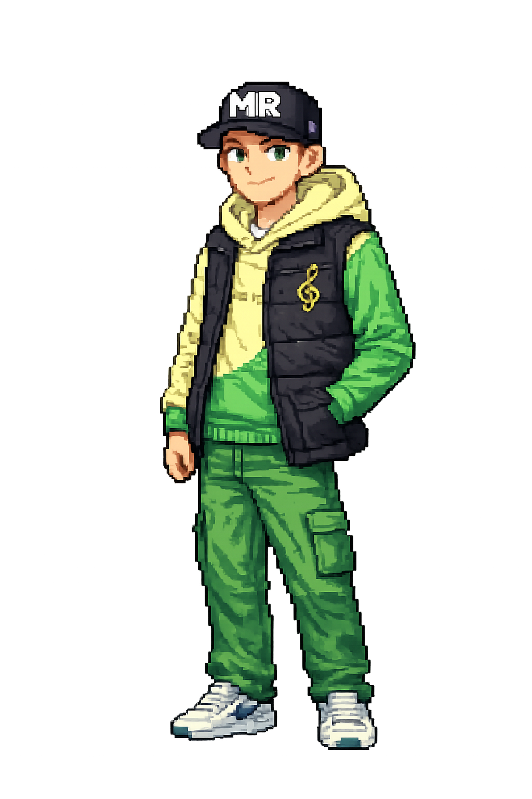
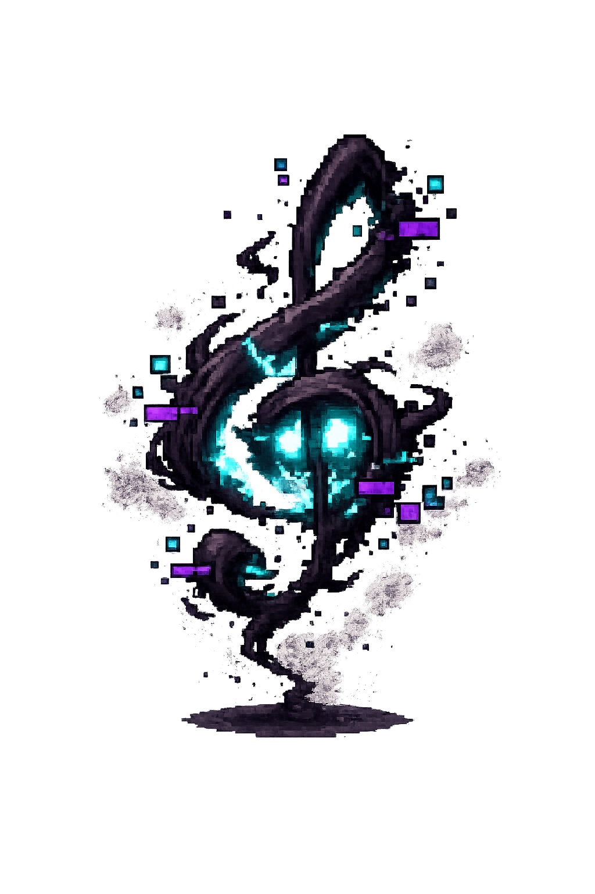
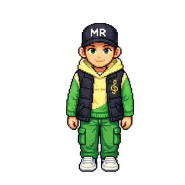
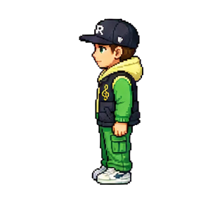
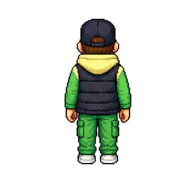
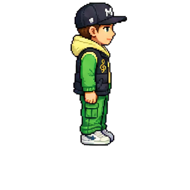
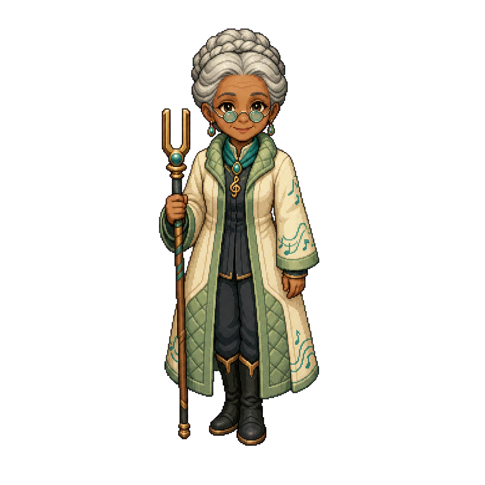
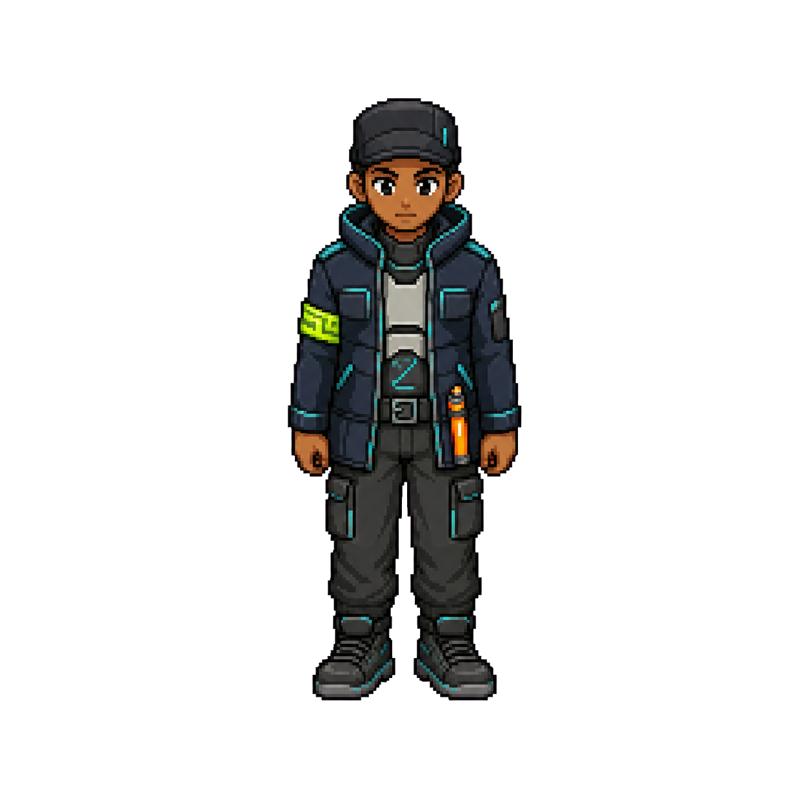
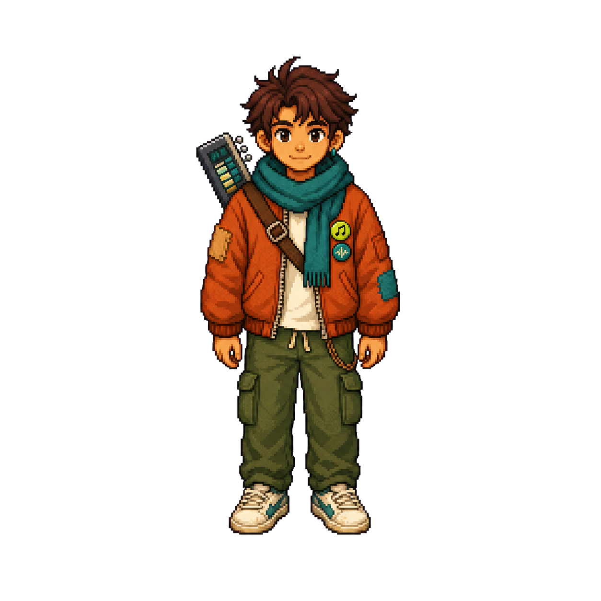

<div align="center">

# 🎧 SOUND QUEST

### Find the Lost Track

**Enter the signal. Fight the noise. Recover what was lost.**

<br>



<br><br>

[](https://react.dev/)
[](https://phaser.io/)
[](https://www.typescriptlang.org/)
[](https://vite.dev/)

<br>

*A browser-based pixel RPG where music, signals and silence collide.*

</div>

---

## 📡 About the Game

**Sound Quest** is a music-inspired pixel RPG built with Phaser, React and TypeScript.

You enter a world where sound has been corrupted.

Explore strange environments, talk to musicians and survivors, collect fragments of the **Lost Track**, survive encounters with corrupted signals and fight your way toward the source of the silence.

Your goal is simple:

> **Recover the Lost Track before the signal disappears forever.**

---

## 🌌 Enter the Signal

The world of Sound Quest combines classic pixel-RPG exploration with a modern audiovisual style inspired by music equipment, signal processing and digital distortion.

Travel through locations such as:

### 🌿 Echo Village

The beginning of your journey.

Meet the **Elder Muse**, learn what happened to the signal and begin searching for the missing fragments.

### ⚡ Neon Junction

A corrupted connection point filled with strange signals, musicians and dangerous encounters.

Meet characters such as the **Junction Guard** and the **Wandering Musician** while getting closer to the source of the disturbance.

### 🕳️ The Corrupted Cave

The signal becomes unstable.

Push deeper into the corruption, survive increasingly dangerous encounters and prepare for what waits below.

---

## ⚔️ Battle the Noise

Sound Quest features a custom turn-based battle system.

Enemies aren't traditional monsters.

They're broken pieces of the signal.

| Enemy                 | Threat                                                 |
| :-------------------- | :----------------------------------------------------- |
| 📺 **Static Noise**   | White Noise · Frequency Jab                            |
| 📡 **Broken Signal**  | Signal Burst · Distortion                              |
| 🔇 **Silence**        | Void Touch · Mute · Dead Air                           |
| 🚪 **The Gatekeeper** | Silence Wave · Void Crush · Gate Slam · Frequency Lock |

<br>

<div align="center">



**The signal is fading.**

</div>

---

## 🎵 Fight Back With Sound

Your attacks are built around music and audio.

Use abilities such as:

```text
BASS DROP
ECHO WAVE
HOOK IMPACT
REVERB STRIKE
```

Each encounter uses its own battle interface with:

* Player and enemy HP
* Attack selection
* Damage variation
* Battle messages
* Animated attacks
* Enemy responses
* Experience rewards
* Boss phases
* Dynamic visual effects

The stronger you become, the further you can push into the corrupted signal.

---

## 👾 The Gatekeeper

At the deepest point of the journey waits **The Gatekeeper**.

A multi-phase boss encounter standing between you and the Lost Track.

<div align="center">

### `SIGNAL STATUS: CRITICAL`

```text
████████████████████████████████████
      CONNECTION UNSTABLE
████████████████████████████████████
```

</div>

The Gatekeeper has significantly more health than ordinary enemies and uses powerful attacks designed around silence, distortion and frequency control.

Defeat it to reach the final part of the signal.

---

## 🗺️ Explore the World

Sound Quest isn't just a battle screen.

The game includes a complete explorable overworld with:

* Player movement
* Animated directional sprites
* Collision
* Multiple world areas
* NPC interaction
* Dialog sequences
* Signs and environmental storytelling
* Tall grass encounters
* Random battles
* Gates and progression areas
* Cave environments
* Collectible fragments
* Boss trigger zones
* Respawning after defeat
* A complete finale sequence

---

## 🧍 Player Animation

The player uses separate directional animation frames for smooth overworld movement.

<div align="center">

<table>
<tr>
<td align="center">

<br>
<sub>Down</sub>
</td>

<td align="center">

<br>
<sub>Left</sub>
</td>

<td align="center">

<br>
<sub>Up</sub>
</td>

<td align="center">

<br>
<sub>Right</sub>
</td>
</tr>
</table>

</div>

---

## 💬 Meet the World

The journey includes several characters that guide the player through the story.

<div align="center">

<table>
<tr>
<td align="center">

<br>
<strong>Elder Muse</strong>
</td>

<td align="center">

<br>
<strong>Junction Guard</strong>
</td>

<td align="center">

<br>
<strong>Wandering Musician</strong>
</td>
</tr>
</table>

</div>

NPC conversations use animated dialog sequences and are tied directly into world progression.

---

## 🎮 Controls

### Desktop

| Action           | Control                  |
| ---------------- | ------------------------ |
| Move             | `WASD` / Arrow Keys      |
| Interact         | Keyboard interaction key |
| Navigate Battles | Mouse / Keyboard         |
| Select Attacks   | Battle UI                |

### Mobile

Sound Quest also includes dedicated mobile input handling, allowing the game to be played using touch controls.

---

## 🧩 Random Encounters

Walking through tall grass can trigger corrupted signals.

Every step carries a chance of starting an encounter.

```text
Walking...
Walking...
Walking...

⚠ WILD SIGNAL DETECTED
```

Enemies vary in strength and provide experience when defeated.

The further the journey progresses, the more dangerous the signal becomes.

---

## 💀 Death & Respawn

Losing a battle doesn't simply reload the browser.

Sound Quest contains a dedicated death sequence and respawn system.

After defeat:

1. The current encounter ends
2. The world is temporarily locked
3. The death sequence is shown
4. The player respawns
5. Exploration continues

Boss encounters can then be attempted again.

---

## 🗺️ Built-in Map Editor

The project also contains a custom editor for building and modifying the game world.

Features include:

* Tile painting
* Tile erasing
* Fill tool
* Tile selection
* Grid management
* Undo / redo
* Clipboard operations
* Camera movement
* Zoom controls
* World-coordinate conversion

This makes the world easier to expand without manually placing every object in code.

---

## 🛠️ Tech Stack

<table>
<tr>
<td><strong>Game Engine</strong></td>
<td>Phaser 3</td>
</tr>

<tr>
<td><strong>UI</strong></td>
<td>React 19</td>
</tr>

<tr>
<td><strong>Language</strong></td>
<td>TypeScript</td>
</tr>

<tr>
<td><strong>State Management</strong></td>
<td>Zustand</td>
</tr>

<tr>
<td><strong>Build Tool</strong></td>
<td>Vite</td>
</tr>

<tr>
<td><strong>Styling</strong></td>
<td>Tailwind CSS</td>
</tr>
</table>

---

## 🏗️ Project Structure

```text
MiniGame/
│
├── public/
│   └── assets/
│       ├── player/
│       ├── enemies
│       ├── NPC artwork
│       └── game assets
│
├── src/
│   ├── game/
│   │   ├── assets/
│   │   ├── entities/
│   │   ├── input/
│   │   ├── scenes/
│   │   ├── systems/
│   │   └── utils/
│   │
│   ├── store/
│   ├── types/
│   └── main.tsx
│
├── index.html
├── package.json
├── tsconfig.json
└── vite.config.ts
```

---

## 🚀 Getting Started

### Requirements

Make sure you have installed:

* **Node.js 18+**
* **npm**

### Clone the repository

```bash
git clone https://github.com/Nick190401/MiniGame.git
cd MiniGame
```

### Install dependencies

```bash
npm install
```

### Start development server

```bash
npm run dev
```

Vite will start the local development server.

Open the displayed local URL in your browser and enter the signal.

---

## 📦 Production Build

Create an optimized production build:

```bash
npm run build
```

Preview the production version locally:

```bash
npm run preview
```

---

## 🧠 Architecture

Sound Quest separates game logic from the surrounding application UI.

### Phaser

Responsible for:

* World rendering
* Player movement
* Physics
* Collision
* NPCs
* Battles
* Animations
* Effects
* Game scenes

### React

Responsible for the surrounding application interface and browser integration.

### Zustand

Maintains shared game state between systems and scenes.

### Event Bus

Game systems communicate through events instead of tightly coupling scenes together.

This allows systems such as:

```text
World
   ↓
Encounter
   ↓
Battle
   ↓
Result
   ↓
World
```

to remain separated while still sharing state.

---

## 🎨 Visual Direction

Sound Quest combines:

* Pixel-art RPG presentation
* Dark backgrounds
* Acid green signal accents
* Cyan highlights
* Orange distortion effects
* CRT / signal aesthetics
* Music-production imagery
* Modern typography
* Retro game mechanics

The result is a world somewhere between a classic RPG and a broken audio workstation.

---

<div align="center">

<br>


## THE TRACK IS STILL OUT THERE.

### Can you recover it before the signal goes silent?

<br>

```text
> CONNECTING TO SIGNAL...
> SEARCHING FOR LOST TRACK...
> CONNECTION ESTABLISHED.
```

<br>

**SOUND QUEST**

*Find the Lost Track.*

<br>

⭐ If you like the project, consider starring the repository.

</div>
